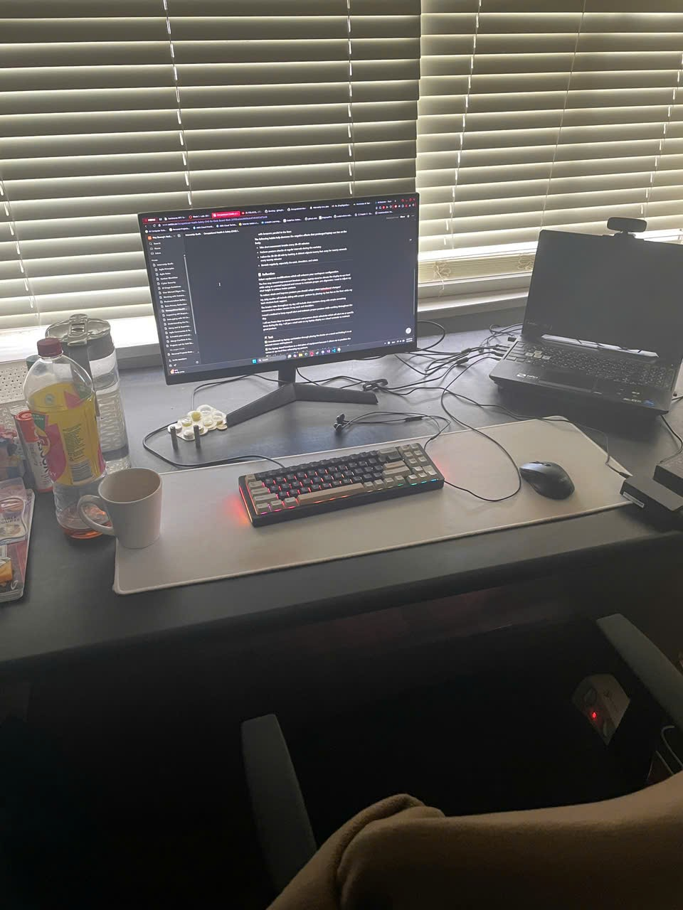

# Occupational Health & Safety (OHS) for Desk-Based Work

### 🔍 **Research & Learn**

**Using a laptop without external monitor or keyboard exposure poses what types of risks?**

The design of laptops with built-in display and keyboard forces users into an unnatural posture because they must bend their necks and shoulders while using the device. The combination of poor posture creates multiple health issues that include back pain and neck discomfort and eyesight problems along with repetitive strain injuries that cause carpal tunnel syndrome.

**Which ergonomic equipment devices help users achieve better posture while working on a laptop?**

- A **laptop stand** functions as a screen elevation tool which enables users to place the display at their eye level.
- The use of **external keyboards together with mice** provides users with better opportunities to position their arms and wrists correctly.
- **Ergonomic chairs** with built-in lower back support systems help users maintain correct spinal alignment for better posture.
- A **footrest** serves as a tool for maintaining correct alignment between legs and feet.

**People should modify their monitor heights and desk arrangements together with chair positions to create a healthier workspace environment.**

- The highest point of the monitor screen must stay at or slightly below eye level.
- The feet must touch the floor completely while maintaining a 90-degree knee angle with hips positioned above knees.
- The desk should be arranged so typing elbows reach 90 degrees while wrists remain straight with forearms parallel to the floor.

**The following habits help decrease the negative effects that prolonged laptop use has on the body.**

- Take short **movement breaks every 30–60 minutes**
- Perform **posture checks** at regular intervals during the workday
- Follow the **20-20-20 rule** by looking at distant objects twenty feet away for twenty seconds every twenty minutes
- **Stretch regularly**, especially the neck, shoulders, and wrists

---

### 

### 📝 **Reflection**

**You should implement which equipment adjustments to enhance your workplace organization?**

I solved the workspace issue by attaching my laptop to an external monitor at eye level which eliminated the need to bend my neck. I prefer using a mechanical keyboard with a mouse because this setup allows me to maintain proper wrist and arm alignment rather than working with the laptop keyboard. My workspace features a large desk mat that functions as both a stability tool and a friction-reducing element for typing and mouse usage. The next equipment addition I plan to purchase is a laptop stand for elevating my laptop display when I don't use the monitor.

**Which behavioral adjustments can you implement to both improve your posture and minimize strain?**

I prevent strain through my upright body position which includes back support along with feet touching the floor. When I type my elbows maintain a 90-degree angle and my wrists stay in a neutral position. I now take brief movement breaks every 45 minutes to stretch my neck and back and shoulders. The small behavioral modifications I made help me maintain comfort while reducing my daily fatigue.

**Which strategies will help you remember to stay upright and interrupt your work to rest throughout your daily activities?**

The Focus Bear app enables users to set microbreak notifications which prompt them to stretch for brief periods between 45 to 60 minutes. The app sends users gentle reminders to conduct posture assessments and body movements which proves effective for users.

I spent many hours coding while leaning forward but never became aware of my body position. A Focus Bear notification displayed a message which read “Time for a microbreak!” The alert interrupted my work so I took a moment to stretch my neck and arms while sitting down. My shoulders released tension instantly when I stretched and I resumed work with enhanced concentration and a new state of freshness.

Here is the image of my current setup:

---

### 🛠️ **Task**

- ✅ My laptop workstation received a transformation through the placement of a stand under the device and the connection of an external mouse and keyboard.
- ✅ The laptop stand functions as a vital piece of equipment because it enables me to position the screen at eye level which enhances my posture.
- ✅ My use of Focus Bear's movement reminders throughout my daily work resulted in better concentration while also decreasing muscle stiffness. The regular breaks helped decrease eye strain while keeping my focus steady.
- ✅ I documented this change by writing about the positive effects it had on my neck and back since their condition significantly improved through screen elevation combined with regular breaks.