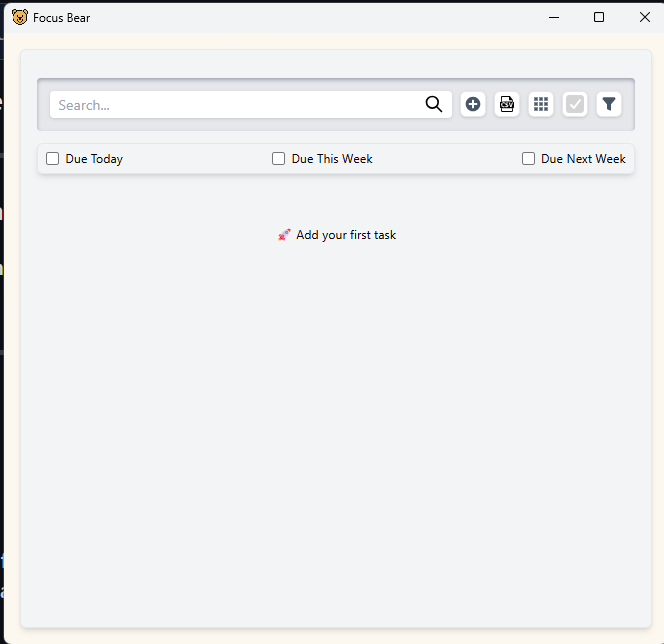

# First-Time User Experience Assignment

### ✅ Focus Bear App Exploration – Usability Review

### 📌 Overview:

The first time I used Focus Bear in a PC environment I took notes on the confusing elements and frustrating parts as well as unclear sections of the application. The current app version requires two specific UI improvements based on the observed onboarding and UI elements (screenshots are attached for reference).

### 🧾 1. **To-Do List Has No Exit or Back Button**

- The To-Do List interface failed to provide any way to exit or return to the dashboard or main screen.
- I encountered difficulty moving between the task list area because it isolated me from the main dashboard.
- A clear "Home" or "Back" button should be added to allow users to return to the main screen instead of making them use the logo to exit.

### 🐻 2. **Unclear Function of “Office Mode” vs. “WFH Mode”**

- The two toggle switches "Limited blocking" contain no explanations about their functions.
- The exact function of these modes remained unknown to me when I started using the app.
- A tooltip should be added to describe the function of "Office Mode" which blocks social media apps while "WFH Mode" blocks entertainment and YouTube content.

### 💡 Onboarding Experience Improvement

The two points in the app became confusing because the system failed to provide proper guidance. The onboarding experience requires the following modifications for improvement:

- The application should display brief tooltips and hover hints to explain advanced toggle features starting with "Office Mode" and "WFH Mode" and "Geek/Simple Mode".
- The app should guide first-time users by providing popup explanations for essential buttons including To-Do List and Brain Dump.
- Users should see a "Getting Started" checklist with 3–5 essential steps during their first launch (starting with task addition and focus session initiation).
- Any user should be able to easily navigate back to the home screen from all sections of the application especially from To-Do List.

The proposed enhancements would allow new users to understand the app without requiring external guidance for their learning process.